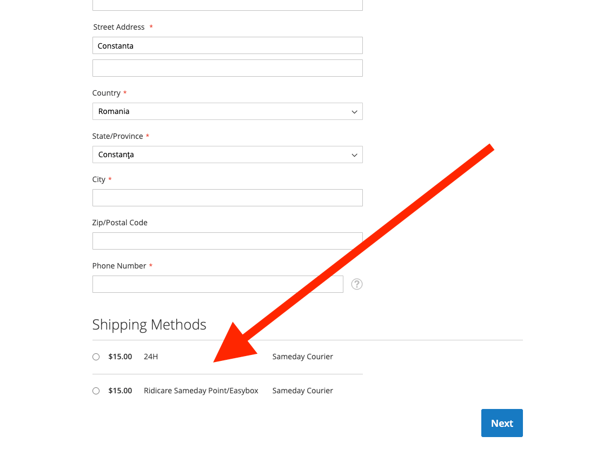

# Magento 2 Sameday Validation Fix

[](https://opensource.org/licenses/MIT)
[](https://magento.com/)
[](https://php.net/)

A Magento 2 module that fixes the Sameday shipping method to properly validate the Country field, which triggers shipping address validation and saving during checkout.

## 🚀 What This Module Does

This module solves a critical issue with the original `sameday/magento2-plugin` where:

- **Problem**: The shipping address is only saved when the "Country" field contains a valid value and passes Magento's default validation
- **Root Cause**: The Sameday plugin doesn't add validation rules for required fields like `country_id`, preventing the shipping address from being updated and saved
- **Solution**: This module adds proper validation rules for the Sameday shipping method that include required field validation for:
  - `country_id` (Country field)
  - `postcode` (Postal code)
  - `region_id` (Region/State)
  - `region_id_input` (Region input for manual entry)

## 🔍 Why This Fix Is Needed

In typical Magento 2 shipping method implementations (like `tablerate`), validation rules are properly defined to trigger address validation. However, the Sameday plugin was missing these crucial validation rules, causing:

1. Country field validation to be skipped
2. Shipping address not being updated when Sameday is selected
3. Incomplete address data being saved
4. Potential checkout issues and shipping calculation problems

## 📋 Requirements

- **PHP**: 7.1, 7.2, 7.3, 7.4, 8.1, 8.2, or 8.3
- **Magento**: 2.x (Community or Commerce Edition)
- **Dependencies**:
  - `magento/framework: ^103.0`
  - `magento/module-checkout: ^100.0`
  - `sameday/magento2-plugin: ^1.9`

## 📦 Installation

### Via Composer (Recommended)

```bash
composer require liquidlab-agency/magento2-sameday-validation-fix
php bin/magento module:enable Liquidlab_SamedayValidationFix
php bin/magento setup:upgrade
php bin/magento setup:di:compile
php bin/magento cache:flush
```

### Manual Installation

1. Download or clone this repository
2. Copy the contents to `app/code/Liquidlab/SamedayValidationFix/`
3. Run the following commands:

```bash
php bin/magento module:enable Liquidlab_SamedayValidationFix
php bin/magento setup:upgrade
php bin/magento setup:di:compile
php bin/magento cache:flush
```

## 🧪 Testing

After installation, test the fix by:

1. Go to your store's checkout page
2. Add a product to cart and proceed to checkout
3. Select "Sameday Courier" as shipping method
4. Verify that changing the country field triggers address validation
5. Confirm the shipping address is properly saved and updated



## 🔄 Compatibility

- **Magento Versions**: 2.3.x, 2.4.x
- **PHP Versions**: 7.1 - 8.3
- **Sameday Plugin**: Compatible with v1.9+
- **Themes**: Works with all themes (Luma, Blank, custom themes)

## 📚 Module Dependencies

This module depends on and extends:
- `Magento_Checkout` - For checkout functionality
- `SamedayCourier_Shipping` - The original Sameday plugin

## 📞 Support

For support, please:
1. Check the [GitHub Issues](https://github.com/liquidlab-agency/magento2-sameday-validation-fix/issues)
2. Contact us at support@liquidlab.ro

## 📄 License

This project is licensed under the MIT License - see the [LICENSE](LICENSE) file for details.

## 🤝 Contributing

1. Fork the repository
2. Create your feature branch (`git checkout -b feature/amazing-feature`)
3. Commit your changes (`git commit -m 'Add some amazing feature'`)
4. Push to the branch (`git push origin feature/amazing-feature`)
5. Open a Pull Request

## 🏷️ Changelog

### v1.0.0
- Initial release
- Added Country field validation for Sameday shipping method
- Fixed shipping address saving issue
- Full PHP 7.1-8.3 compatibility

---

**Made with ❤️ by [Liquidlab](https://liquidlab.ro)**
